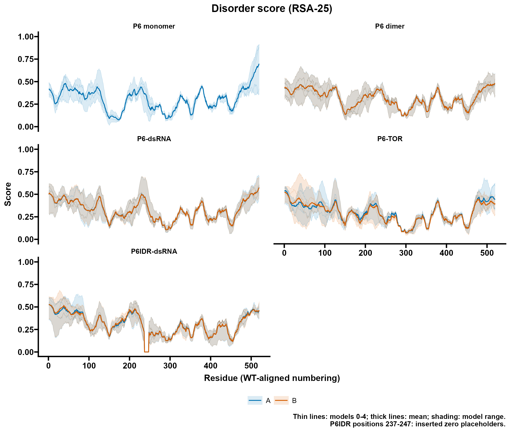
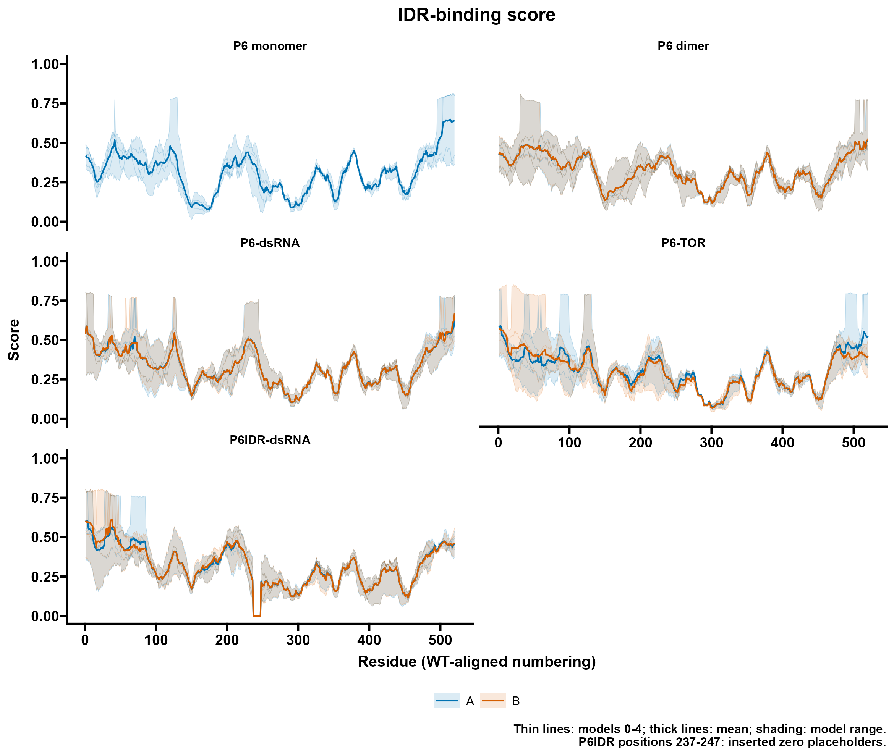
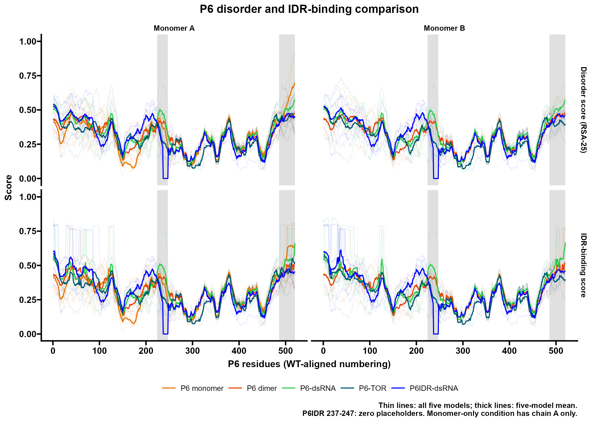

**affiliations:** 1. Department of Plant Biology, Uppsala BioCenter, Swedish University of Agricultural Sciences and Linnean Center for Plant Biology, Box 7080, 75007 Uppsala, Sweden.
2. Institut de Biologie Moléculaire des Plantes, UPR2357 du Centre National de la Recherche Scientifique, Université de Strasbourg, Strasbourg F-67084, France

* equal contribution
+ **correspondence:** anders.hafren@slu.se

# Methods : Protein Complex Structure 

P6 dimer complexes with either a 30bp dsRNA duplex or TOR were predicted using Alphafold3  @abramson2024accurate and Protenix @bytedance2025protenix with default parameters, retaining per model ipTM, ptm, pLDDT, and GPDE confidence metrics to benchmark confidence. The dsRNA sequence used was AAGCUUCAAAUUAAGUCAGCUCCUUAAAUG and its reverse complement. From Protenix JSON output, Predicted Aligned Error (PAE) and Predicted Distance Error (PDE) from all 5 models, and the single-residue contact-probability (CP) matrix was extracted and processed into per-residue level interface statistics by extracting the minimal PAE or maximal contact of the Protein-Protein interaction surface of P6-to-itself, P6 dimers, P6 to 30bp dsRNA duplex, or P6 bound to TOR.

## CaMV P6 structural analysis

This repository contains the structural models, prediction inputs, analysis
code, processed results, and computational figures supporting the analysis of
the *Cauliflower mosaic virus* (CaMV) P6 protein in the manuscript:

> Condensation on dsRNA switches CaMV P6 from Target of Rapamycin activation
> for virus translation to viroplasm services.

The analysis compares P6 homodimers predicted in complex with a 30-bp dsRNA
duplex or with *Arabidopsis thaliana* TARGET OF RAPAMYCIN (TOR). It also
includes the P6IDR construct in which the conditionally folding region at
residues 224-247 was modified, modelled as a dimer with the same dsRNA duplex.
Models were generated with Protenix using the prediction inputs and seeds
provided here. AlphaFold 3 models used as independent structural comparisons
are deposited under `Models/AlphaFold3/`.

### Repository contents

| Directory | Contents |
|---|---|
| `Inputs/` | Protenix inputs containing the sequences and complex stoichiometries. |
| `Models/` | Ranked Protenix coordinate models and confidence summaries, representative manuscript models, and the AlphaFold 3 comparison models. |
| `Raw/` | Compressed Protenix full-data JSON outputs used for metric extraction. |
| `Code/` | Scripts for extracting PAE, PDE, pLDDT, and contact-probability information and regenerating the main interface plots. |
| `Data/` | Analysis-ready R objects used by the plotting workflow. |
| `Results/` | Per-residue interface summaries and supplementary result tables. |
| `Figures/` | Computational plots generated from the deposited analyses. |


### Deposited complexes

| Complex | Composition | Protenix seed | Samples | Manuscript model |
|---|---|---:|---:|---|
| P6-dsRNA | Two 520-aa P6 chains and two complementary 30-nt RNA strands | 95890 | 5 | `Models/Model_S1_P6-dsRNA.cif.gz` |
| P6-TOR | Two 520-aa P6 chains and one 2,481-aa *A. thaliana* TOR chain | 88467 | 5 | `Models/Model_S2_P6-TOR.cif.gz` |
| P6IDR-dsRNA | Two 509-aa P6IDR chains and two complementary 30-nt RNA strands | 95890 | 5 | `Models/Representative_P6-IDR-dsRNA.cif.gz` |

The supplementary wild-type model files are copies of sample 0 from the
corresponding five-model prediction sets. 

In the P6IDR modelled construct, wild-type residues 224-247
(`WLTLGTKRPSSDPAPKEISFAPEI`) are replaced by the 13-residue sequence
`QTGVAYIPGAKCG`, producing a 509-aa chain. Relative to the deposited wild-type
input, the modelled construct also contains V142L. 

### Requirements

- Python 3.10 or later for extracting matrices from Protenix JSON output.
- R 4.4 or later for the analysis and plotting scripts.
- R packages: `rmarkdown`, `ggplot2`, `dplyr`, `readr`, `tidyr`, `scales`, and `svglite`.

Create the R environment with:

```r
install.packages(c("rmarkdown", "ggplot2", "dplyr", "readr", "tidyr", "scales", "svglite"))
```

### Reproducing metric extraction

The compressed full-data JSON files contain the model-wise PAE, PDE, pLDDT,
and contact-probability outputs. Extract the pairwise matrices with:

```bash
python Code/extract_protenix_metrics.py \
  --input-dir Raw/P6-dsRNA \
  --prefix P6_dimer_dsRNA \
  --output-dir Data/Matrices

python Code/extract_protenix_metrics.py \
  --input-dir Raw/P6-TOR \
  --prefix P6_dimer_TOR \
  --output-dir Data/Matrices

python Code/extract_protenix_metrics.py \
  --input-dir Raw/P6-IDR-dsRNA \
  --prefix P6_dimer_ivIDR_dsRNA \
  --output-dir Data/Matrices
```

Each command writes compressed CSV matrices for `token_pair_pae`,
`token_pair_pde`, and `contact_probs`, together with a table of atom-level
pLDDT values. Processing the P6-TOR full-data files requires substantial RAM.

## Regenerating interface plots

The analysis-ready objects in `Data/` contain the per-residue values used for
the manuscript plots. From the repository root, run:

```bash
Rscript Code/plot_p6_interfaces.R
```

The script writes regenerated SVG files to `Figures/Reproduced/`. The
publication versions are retained in `Figures/` for direct comparison.

### Interpretation

PAE and PDE report model confidence rather than experimental binding affinity.
Contact probability identifies model-supported contacts but does not establish
that an interaction occurs in vivo. The deposited models should therefore be
interpreted together with the experimental condensation and translation assays
reported in the manuscript.


# Methods : Disorder Prediction 

Intrinsic disorder and conditional folding propensity were estimated using [AlphaFold-Disorder](https://github.com/BioComputingUP/AlphaFold-disorder) @piovesan2022intrinsic. 

## Changes to the original AlphaFold-disorder script

Comparison of [Code/alphafold_disorder_fixed.py](Code/alphafold_disorder_fixed.py)
with the [original script](https://github.com/BioComputingUP/AlphaFold-disorder/blob/main/alphafold_disorder.py)
(upstream `main`, inspected 9 September 2026) identifies these compatibility changes:

| Location | Original | Local change |
|---|---|---|
| Single structure, file-list and directory input branches | Accumulate with `DataFrame.append`. | Use `pd.concat([data, processed_data], ignore_index=True)` in all three branches. |
| Prediction accumulation | Repeatedly append predictions to a DataFrame. | Collect frames in `pred_list`, concatenate once with `ignore_index=True`, and return an empty DataFrame when the list is empty. |

These changes remove use of `DataFrame.append`, unavailable in pandas 2,
and reset concatenated row indices. They do not change the RSA window,
reflection padding, scoring equations, default threshold, DSSP extraction,
or exported columns. A header annotation in the local Python file records
this scope; its scoring code has not been altered for this analysis.

The inherited parser enumerates all residues in a structure and prediction
smoothing groups by filename, not chain. To regenerate equivalent scores,
provide one protein chain per input structure, with pLDDT stored in the
C-alpha B-factor and DSSP 3.x available as `mkdssp`. Multi-chain or RNA-containing
complexes must be prepared first: the compatibility fix does not add chain
splitting, RNA filtering or residue-number mapping. Chain-labelled table
names alone do not establish how the original coordinate inputs were prepared.

## All-model, both-chain analysis

The input [prediction table](Data/af_disorder_AllP6s_pred.tsv) contains
23,290 residue records from 45 model-chain profiles. We retain samples 0-4
for P6 dimer, P6-dsRNA, P6-TOR and P6IDR-dsRNA, including both P6 chains A
and B (10 profiles per condition). The P6 monomer condition contains five
chain-A profiles only; no chain B is present. Wild-type profiles contain
520 residues and P6IDR profiles contain 509 residues. Seeds and sample
identifiers are parsed from the input names and exported in the coverage table.

The score columns have distinct meanings:

| Column | Definition and interpretation |
|---|---|
| `lddt` | C-alpha B-factor divided by 100, interpreted as pLDDT on a 0-1 scale. |
| `disorder` | `1 - lddt`; a confidence-derived disorder proxy. |
| `disorder-25` | Mean DSSP relative solvent accessibility (RSA) in a centred 25-residue window, using reflected padding at the termini. This is the disorder score in the main plot, not smoothed `1 - pLDDT`. |
| `binding-25-0.581` | Equals `disorder-25` when that score is at most 0.581; otherwise equals `0.581 + 0.419 * lddt`. This is the IDR-binding/conditional-folding score. |

These definitions follow the [upstream implementation](https://github.com/BioComputingUP/AlphaFold-disorder/blob/main/alphafold_disorder.py).
The binding score is not a calibrated binding probability or affinity.
The RSA value 0.581 is the transformation threshold, not a significance
cutoff. The analysis uses the deposited scores without rerunning DSSP.

The [analysis script](Code/plot_p6_disorder.R) validates model and chain
coverage, contiguous residue numbering, duplicate keys and score ranges.
For each condition, chain and residue, it calculates the mean, sample SD
and range across five models. Plots retain individual model traces and
show the mean and range separately for chains A and B. The range describes
prediction variability, not a confidence interval. The model-chain summary
contains each whole-chain mean; the ensemble summary first averages A and
B within each model, then reports the mean and SD across five models.
Chains and prediction samples are not independent biological replicates;
no inferential tests are applied.

P6IDR plots follow the previous WT-coordinate padding convention: mutant positions 237 onward are shifted by 11, and positions 237-247 are inserted with score zero for every model, chain and metric. The 13-residue replacement occupies display positions 224-236; these replacement residues are not identical to the corresponding WT residues. The inserted zeros are plotting placeholders, not predictions of ordered residues. They are flagged by `is_placeholder` in the residue summary and [aligned model-chain table](Results/Disorder/aligned_model_chain_scores.csv), which also preserves `construct_pos`. Whole-chain summaries exclude these placeholders and retain the original 509 measured positions for P6IDR (520 for WT). The filename-defined
monomer and dimer controls are retained as labelled in the supplied table.

## Reproducing the analysis and Prism-style plots

Whole-chain scores (mean +/- SD across five models, after averaging the
available chains within each model) are:

| Condition | Disorder score (RSA-25) | IDR-binding score |
|---|---:|---:|
| P6 monomer | 0.305 +/- 0.024 | 0.307 +/- 0.025 |
| P6 dimer | 0.316 +/- 0.027 | 0.319 +/- 0.031 |
| P6-dsRNA | 0.325 +/- 0.038 | 0.330 +/- 0.042 |
| P6-TOR | 0.293 +/- 0.012 | 0.298 +/- 0.014 |
| P6IDR-dsRNA | 0.315 +/- 0.015 | 0.320 +/- 0.020 |

P6-dsRNA has the highest whole-chain mean for both scores and P6-TOR the
lowest in this dataset. These descriptive differences coexist with model
variation and do not establish an experimental change in disorder or binding.
The residue profiles reveal local variation that whole-chain means conceal.

From the repository root, install the plotting dependencies and run:

```r
install.packages(c("ggplot2", "ggprism", "dplyr", "tidyr", "readr", "svglite"))
source("Code/plot_p6_disorder.R")
```

The script uses `theme_prism(base_size = 16)` followed by
`theme(plot.title = element_text(hjust = 0.5), legend.position = "bottom")`
so the requested title alignment and legend position override theme defaults.
It saves PNG and editable SVG plots in `Figures/Disorder/`, and coverage,
residue, model-chain and ensemble summaries plus R session information in
`Results/Disorder/`.





The combined comparison below places all P6 conditions together, with
columns for monomer A and B and rows for the two scores. Thin traces show
all five models and thick lines show their means. It reuses the original
`ProteinStructureBeginning/IntrinsicallyDisorderRegions/Readme.Rmd` colours:
monomer `#E67300`, dimer `#E64000`, dsRNA `#28CC48`, P6IDR-dsRNA `blue`
(previously `rigid-dsRNA`), and TOR `#005770`. Grey bands mark residues
224-247 and 486-520 as in the original plot. The monomer-only condition
appears in the A column because no B profile is deposited.



Only the IDR mutant receives the previous 237-247 padding correction,
now independently for all five models, both chains and every score.
The previous metric loop overwrote its result on each iteration; this
implementation retains the inserted rows for every metric. The gap is
11 residues (`247 - 237 + 1`), correcting the old `# 44` comment.
The supplementary [1 - pLDDT plot](Figures/Disorder/one_minus_plddt.png)
keeps the confidence-derived proxy available alongside the RSA-based score.


# License

Code is released under the GNU General Public License v3.0. The manuscript,
figures, model outputs, and third-party software remain subject to their
respective licences and citation requirements.

# References
